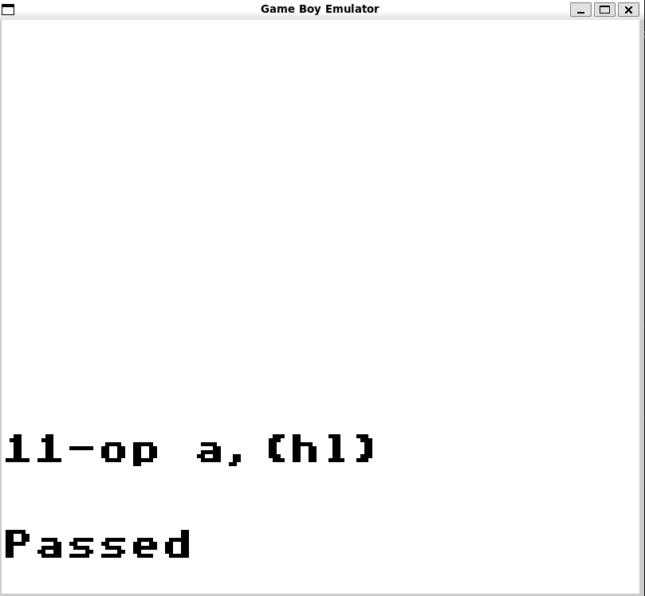
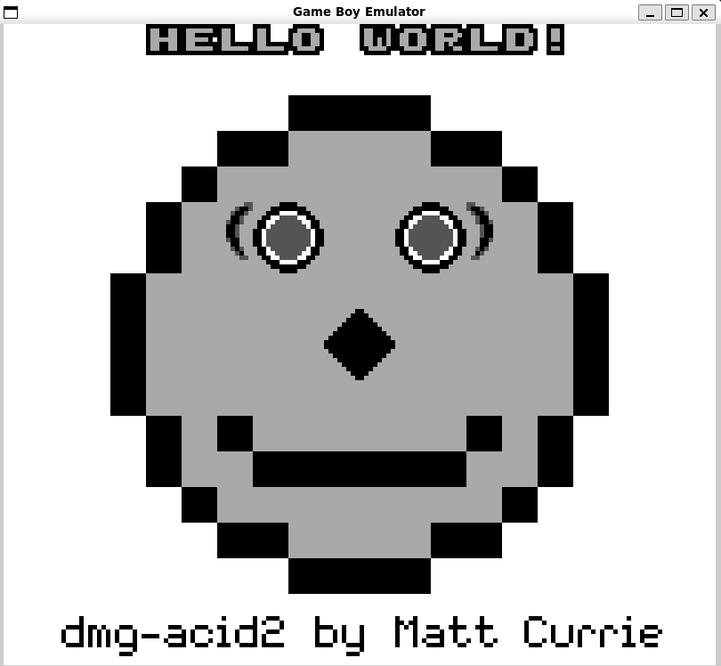
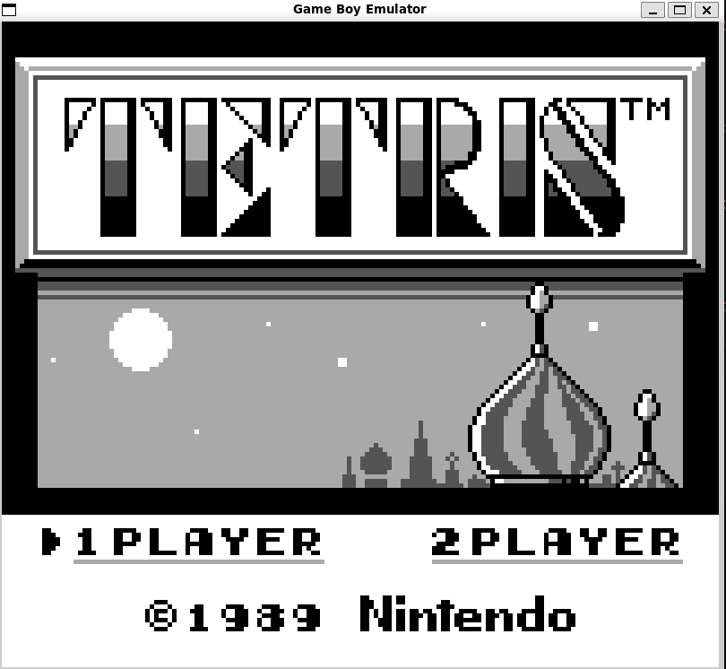
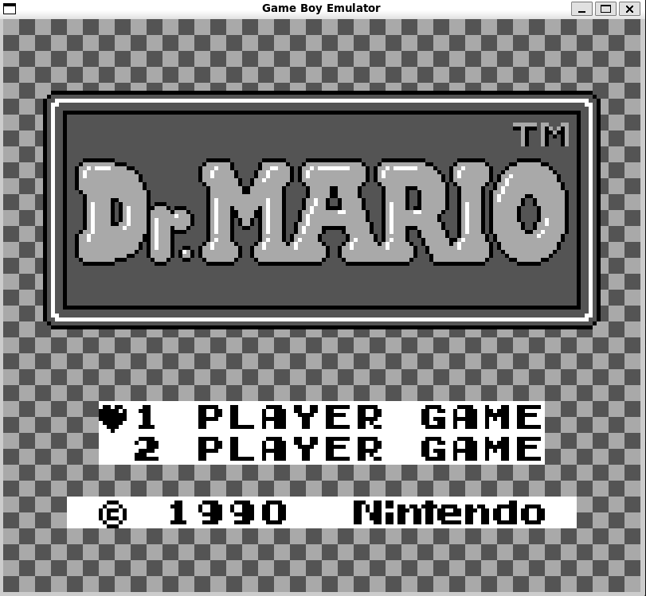

# Game Boy Emulator

Cycle-accurate-ish Game Boy (DMG) emulator in C++ with CPU, memory, and PPU subsystems.

* Passes all CPU blargg tests
* Passes dmg-acid2 test for ppu
* Tetris and Dr.Mario run perfectly

## Screenshots

    

        Blargg Test passing (showing the 11th one)  
        
    

    

        Dmg-Acid 2 Test passing  
        
    

    

        Tetris running  
        
    

    

        Dr.Mario running  
        
    

## Demo

    

        Tetris Running  
        <video src="/screenshots/tetris_running.mp4" width="300px" alt="Tetris running">
    

    

        Dr.Mario Running  
        <video src="/screenshots/drMario_running.mp4" width="300px" alt="Dr.Mario running">
    

